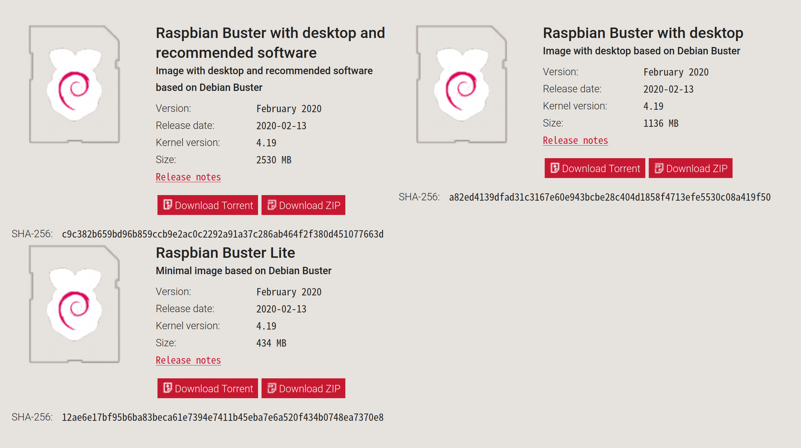
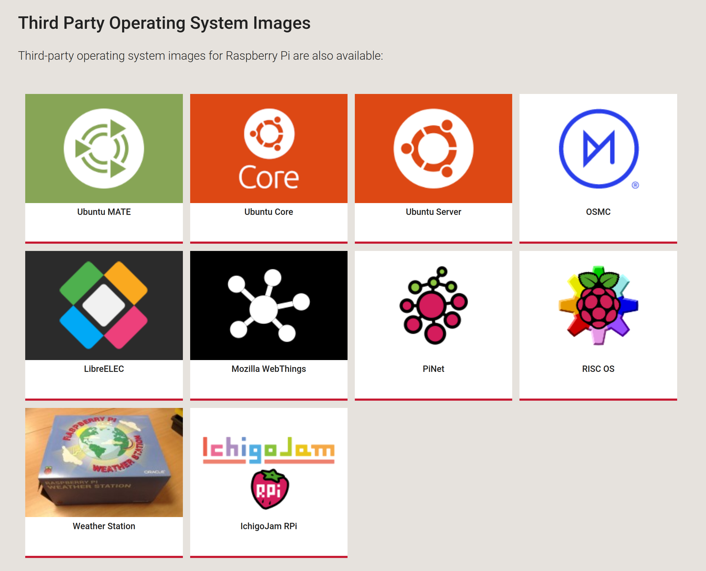
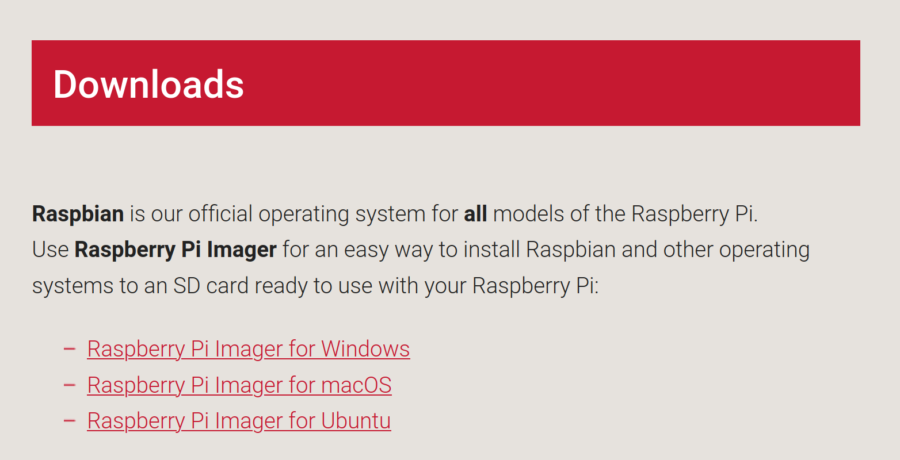

# Install Operating System

### Choose the OS

The official Operating System of Raspberry Pi is Raspbian. It is orginated from Debian.

There are also other Third party Linux or Windows system for Raspberry Pi like Ubuntu Mate, Arch for ARM, Windows IoT, etc.

I chose the official Raspbian with desktop. It can be download from [here](https://www.raspberrypi.org/downloads/raspbian/)

Note that if you choose the "Lite" one, you will only get a command line interface.

The one with desktop and recommended software will contain some useful softwares. You can also choose not to install them by select the one only with desktop and install your favorite softwares later manually like me.

### Write the OS into microSD card

After download the OS image in the format of .img, we can write the system into our microSD(TF) card. Then we can boot our system from the microSD card.

The [official site](https://www.raspberrypi.org/downloads/) offers tool to write the image into microSD card.

